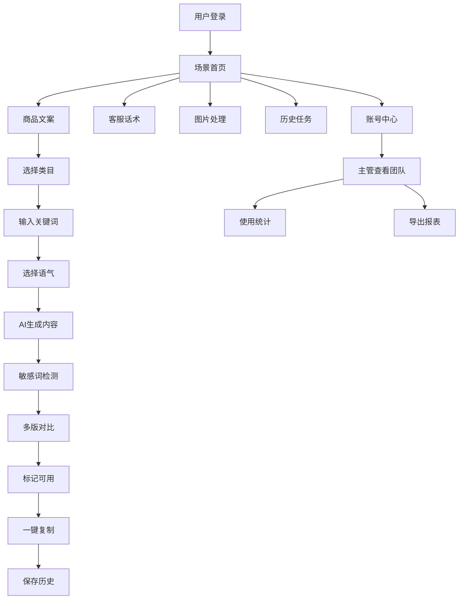

## 1. 产品概述

AI工具箱是服务电商店铺运营的智能工作台，整合多种AI能力帮助运营人员在上新、客服和活动准备场景中高效完成工作。通过一站式的AI能力调用，解决运营人员在多平台间切换、内容产出效率低、质量不稳定等痛点。

- **目标用户**：电商运营人员、客服专员、活动策划、部门主管
- **核心价值**：提升内容产出效率3-5倍、统一品牌话术风格、降低敏感词违规风险、沉淀高转化内容资产

## 2. 核心功能

### 2.1 用户角色

| 角色 | 登录方式 | 核心权限 |
|------|----------|----------|
| 普通运营 | 账号密码登录 | 使用全部AI能力、管理个人历史、收藏模板 |
| 主管 | 账号密码登录 | 所有普通运营权限 + 查看团队使用记录、统计分析 |

### 2.2 功能模块

1. **场景首页**：功能入口导航、本周使用统计、快捷模板、最近任务
2. **商品文案页**：类目选择生成标题、批量改写卖点、品牌语气设置、多版对比、敏感词检测
3. **客服话术页**：差评回复整理、活动短信生成、竞品要点提取、模板收藏
4. **图片处理页**：图片背景替换、尺寸裁剪、批量处理、效果预览
5. **历史任务页**：任务列表筛选、结果标记可用、一键复制、版本对比
6. **账号中心**：个人信息、品牌语气设置、团队管理（主管）、使用统计

### 2.3 页面详情

| 页面名称 | 模块名称 | 功能描述 |
|---------|----------|----------|
| 场景首页 | 功能导航区 | 6大场景卡片入口，图标+文字+使用次数展示 |
| 场景首页 | 统计概览 | 本周使用次数柱状图、高转化模板排行、敏感词预警数 |
| 场景首页 | 快捷操作 | 最近使用的3个任务、一键重新生成 |
| 商品文案页 | 标题生成器 | 选择商品类目（下拉多级选择）、输入关键词、生成多个标题候选 |
| 商品文案页 | 卖点改写 | 批量输入原始卖点、选择改写风格、一键生成多版卖点 |
| 商品文案页 | 品牌语气 | 保存常用品牌语气风格、一键应用到所有生成内容 |
| 商品文案页 | 输出对比 | 多版内容并排对比、标记可用、一键复制到电商平台 |
| 客服话术页 | 差评回复 | 输入差评内容、自动生成安抚+解决方案式回复 |
| 客服话术页 | 活动短信 | 输入活动信息、生成多版短信文案、自动检测字数 |
| 客服话术页 | 竞品分析 | 输入竞品链接/文案、提取核心卖点和差异化要点 |
| 客服话术页 | 模板收藏 | 收藏高转化话术、分类管理、快速调用 |
| 图片处理页 | 背景替换 | 上传商品图、选择背景风格、一键替换 |
| 图片处理页 | 智能裁剪 | 按平台尺寸要求（淘宝/京东/抖音）自动裁剪 |
| 历史任务页 | 任务列表 | 按时间/类型/状态筛选、分页展示 |
| 历史任务页 | 结果管理 | 标记可用/不可用、添加备注、版本对比 |
| 历史任务页 | 一键复制 | 复制到剪贴板、支持多种平台格式 |
| 账号中心 | 个人设置 | 头像、昵称、密码修改 |
| 账号中心 | 品牌语气 | 设置品牌调性、常用语、禁用词库 |
| 账号中心 | 使用统计 | 个人/团队使用次数热力图、功能使用率排行 |
| 账号中心 | 团队管理 | 查看团队成员使用记录、导出报表（仅主管） |

## 3. 核心流程

### 3.1 商品标题生成流程
用户进入商品文案页 → 选择商品类目（一级→二级→三级）→ 输入商品关键词和特性 → 选择品牌语气 → 点击生成 → 系统生成3-5个候选标题 → 敏感词自动检测并标红提醒 → 用户多版对比 → 标记满意的结果 → 一键复制到淘宝/京东等平台 → 任务自动保存到历史记录

### 3.2 差评回复流程
用户进入客服话术页 → 选择差评回复功能 → 粘贴买家差评内容 → 选择回复风格（安抚/专业/补偿）→ 点击生成 → 系统生成2-3版回复 → 可手动调整 → 标记可用 → 复制到客服后台 → 收藏高转化回复模板

### 3.3 主管查看团队记录流程
主管登录 → 进入账号中心 → 选择团队管理 → 查看团队成员列表 → 点击某成员 → 查看其周/月使用详情 → 查看功能使用分布 → 导出Excel报表

## 4. 用户界面设计

### 4.1 设计风格
- **主色调**：深邃蓝 `#1E40AF` 作为主色，代表专业和信赖；琥珀橙 `#F59E0B` 作为强调色，用于操作按钮和重要提示
- **辅助色**：成功绿 `#10B981`、警告红 `#EF4444`、中性灰系列
- **按钮风格**：圆角8px，悬停有轻微上浮阴影，点击有按压反馈
- **字体**：标题使用 "Noto Sans SC" 700，正文使用 "Noto Sans SC" 400，代码和数字使用 "JetBrains Mono"
- **布局风格**：左侧固定导航栏 + 右侧内容区，卡片式模块布局，充足留白
- **图标风格**：Lucide React 线性图标，统一16px/20px尺寸

### 4.2 页面设计概览

| 页面名称 | 模块名称 | UI Elements |
|---------|----------|-------------|
| 场景首页 | Hero区 | 渐变背景、大标题+副标题、CTA按钮、微妙动效 |
| 场景首页 | 功能卡片 | 6个彩色渐变卡片，悬停放大动效，显示使用次数 |
| 场景首页 | 统计区 | 迷你柱状图（纯CSS实现）、数字跳动动效 |
| 商品文案页 | 配置面板 | 左侧表单区，多级下拉、标签选择、滑块控件 |
| 商品文案页 | 输出区 | 右侧多栏对比布局，卡片式展示每版结果，标红敏感词 |
| 客服话术页 | 功能切换 | Tab切换不同子功能，淡入淡出过渡动画 |
| 历史任务页 | 列表区 | 表格+卡片混合视图，筛选器固定顶部，支持批量操作 |
| 账号中心 | 侧边栏 | 二级导航，激活态高亮，平滑过渡 |

### 4.3 响应式
- **桌面端优先**：1440px及以上为最佳体验，主内容区最大宽度1280px
- **平板适配**：1024px时导航栏折叠为图标模式，内容区自适应
- **移动端**：768px以下转为底部Tab导航，卡片单列布局，表单简化

### 4.4 交互动效
- 页面加载：元素从下往上渐入， stagger 延迟100ms
- 卡片悬停：向上平移2px + 阴影加深 + 边框高亮
- 按钮点击：scale(0.97) 按压效果
- Tab切换：内容区淡入淡出 + 下划线滑动
- 生成过程：骨架屏脉冲动画 + 进度条
- 敏感词提醒：红色脉冲边框 + Tooltip 提示
