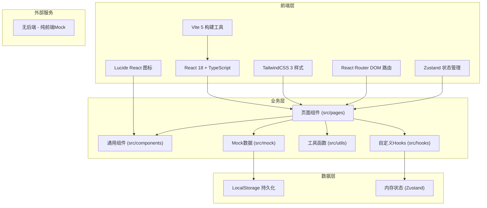
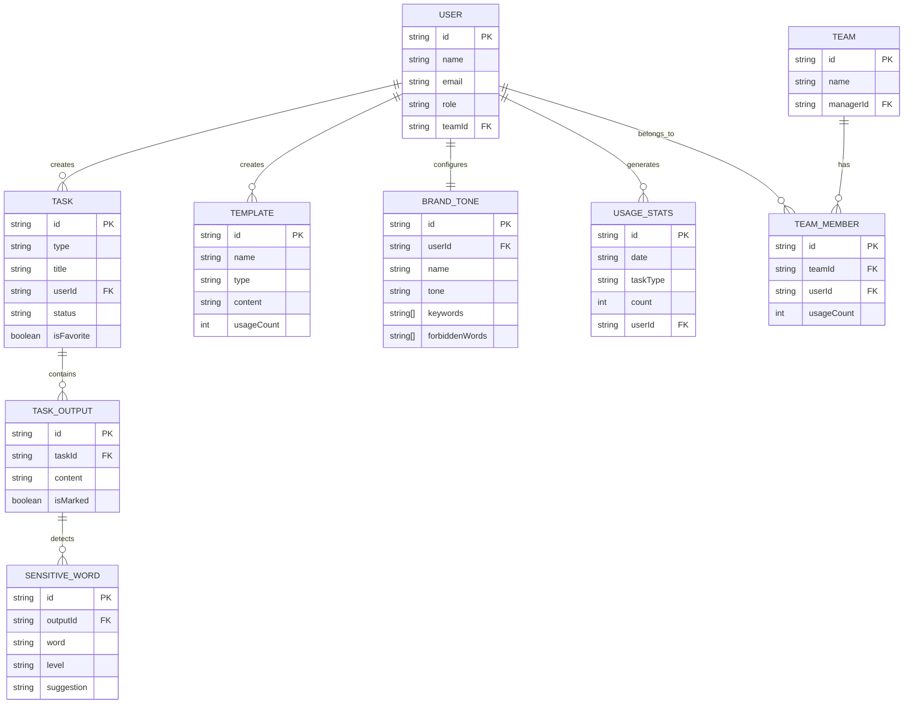

## 1. 架构设计



## 2. 技术描述

- **前端框架**：React@18.2.0 + TypeScript@5.4.0
- **构建工具**：Vite@5.2.0
- **样式方案**：TailwindCSS@3.4.0 + PostCSS@8.4.0
- **路由管理**：react-router-dom@6.22.0
- **状态管理**：zustand@4.5.0
- **图标库**：lucide-react@0.344.0
- **后端**：无（纯前端Mock实现，数据存储于LocalStorage）
- **数据库**：LocalStorage + 内存状态

## 3. 路由定义

| 路由路径 | 页面名称 | 功能说明 |
|---------|----------|----------|
| `/` | 场景首页 | 功能导航、统计概览、快捷操作 |
| `/product-copy` | 商品文案页 | 标题生成、卖点改写、品牌语气、多版对比 |
| `/customer-service` | 客服话术页 | 差评回复、活动短信、竞品分析、模板收藏 |
| `/image-processing` | 图片处理页 | 背景替换、智能裁剪、批量处理 |
| `/history` | 历史任务页 | 任务列表、筛选、标记、复制、对比 |
| `/account` | 账号中心 | 个人设置、品牌语气、使用统计、团队管理 |
| `/account/team` | 团队管理页 | 成员列表、使用详情、导出报表（主管） |
| `/login` | 登录页 | 账号密码登录 |

## 4. 数据模型

### 4.1 核心数据类型定义

```typescript
// 用户类型
interface User {
  id: string;
  name: string;
  email: string;
  avatar: string;
  role: 'operator' | 'manager';
  teamId?: string;
  createdAt: string;
}

// 品牌语气配置
interface BrandTone {
  id: string;
  name: string;
  description: string;
  tone: 'professional' | 'friendly' | 'luxury' | 'playful';
  keywords: string[];
  forbiddenWords: string[];
  isDefault: boolean;
}

// 任务记录
interface Task {
  id: string;
  type: TaskType;
  subType: string;
  title: string;
  input: Record<string, any>;
  outputs: TaskOutput[];
  status: 'pending' | 'completed' | 'marked';
  markedOutputId?: string;
  createdAt: string;
  userId: string;
  isFavorite: boolean;
  category?: string;
}

type TaskType = 'product' | 'service' | 'image';

interface TaskOutput {
  id: string;
  content: string;
  sensitiveWords: SensitiveWord[];
  isMarked: boolean;
  version: number;
}

interface SensitiveWord {
  word: string;
  position: number;
  level: 'warning' | 'danger';
  suggestion: string;
}

// 收藏模板
interface Template {
  id: string;
  name: string;
  type: TaskType;
  content: string;
  usageCount: number;
  conversionRate?: number;
  createdAt: string;
}

// 使用统计
interface UsageStats {
  date: string;
  taskType: TaskType;
  count: number;
  userId: string;
}

// 团队成员
interface TeamMember {
  id: string;
  userId: string;
  name: string;
  email: string;
  avatar: string;
  usageCount: number;
  lastActive: string;
  taskDistribution: Record<TaskType, number>;
}
```

### 4.2 ER图



### 4.3 LocalStorage 存储结构

```typescript
// 存储键名
const STORAGE_KEYS = {
  CURRENT_USER: 'ai_toolbox_current_user',
  TASKS: 'ai_toolbox_tasks',
  TEMPLATES: 'ai_toolbox_templates',
  BRAND_TONES: 'ai_toolbox_brand_tones',
  USAGE_STATS: 'ai_toolbox_usage_stats',
  TEAM_MEMBERS: 'ai_toolbox_team_members',
};
```

## 5. 核心模块结构

```
src/
├── components/          # 通用组件
│   ├── Layout/         # 布局组件
│   │   ├── Sidebar.tsx
│   │   ├── Header.tsx
│   │   └── index.tsx
│   ├── ui/             # 基础UI组件
│   │   ├── Button.tsx
│   │   ├── Card.tsx
│   │   ├── Input.tsx
│   │   ├── Select.tsx
│   │   ├── Tab.tsx
│   │   ├── Modal.tsx
│   │   └── Tooltip.tsx
│   ├── TaskOutputCard.tsx    # 输出结果卡片
│   ├── SensitiveWordBadge.tsx # 敏感词标记
│   ├── StatsChart.tsx         # 统计图表
│   └── CategorySelect.tsx     # 类目选择器
├── pages/              # 页面组件
│   ├── Home.tsx
│   ├── ProductCopy.tsx
│   ├── CustomerService.tsx
│   ├── ImageProcessing.tsx
│   ├── History.tsx
│   ├── Account.tsx
│   ├── TeamManagement.tsx
│   └── Login.tsx
├── hooks/              # 自定义Hooks
│   ├── useTaskGenerator.ts   # AI生成逻辑
│   ├── useSensitiveWord.ts   # 敏感词检测
│   ├── useStats.ts           # 统计计算
│   ├── useClipboard.ts       # 一键复制
│   └── useLocalStorage.ts    # 本地存储
├── store/              # Zustand状态
│   ├── useUserStore.ts
│   ├── useTaskStore.ts
│   ├── useTemplateStore.ts
│   └── useBrandToneStore.ts
├── utils/              # 工具函数
│   ├── mockData.ts     # Mock数据生成
│   ├── aiGenerator.ts  # AI生成模拟
│   ├── sensitiveWords.ts # 敏感词库
│   ├── statistics.ts   # 统计计算
│   └── formatters.ts   # 格式化工具
├── mock/               # Mock数据
│   ├── users.ts
│   ├── tasks.ts
│   ├── templates.ts
│   └── categories.ts
├── types/              # TypeScript类型
│   └── index.ts
├── App.tsx
├── main.tsx
└── index.css
```

## 6. 核心功能实现方案

### 6.1 AI生成模拟（无真实API）
- 使用预设模板 + 随机组合算法模拟AI生成
- 每种任务类型预置10-20个高质量模板
- 根据输入关键词动态替换和组合生成内容
- 生成3-5个不同版本供用户对比

### 6.2 敏感词检测
- 内置常见电商敏感词库（极限词、违规词等）
- 使用AC自动机算法进行高效多模式匹配
- 检测结果标注位置和风险等级（警告/危险）
- 提供替换建议

### 6.3 多版对比功能
- 支持2-4个输出并排展示
- 支持点击标记"可用"状态
- 支持一键复制单个版本或全部标记版本
- 支持版本间差异高亮对比

### 6.4 使用统计
- 按日期记录每次功能使用
- 前端计算周/月统计数据
- CSS实现柱状图和热力图可视化
- 支持按用户、按功能类型筛选

### 6.5 团队管理（主管角色）
- Mock团队成员数据
- 展示每位成员的使用详情
- 支持按时间范围筛选
- 导出CSV格式报表（前端生成）

## 7. 构建与部署

- **开发命令**：`npm run dev`
- **构建命令**：`npm run build`
- **类型检查**：`npm run check`
- **输出目录**：`dist/`
- **部署方式**：纯静态文件，可部署到任何静态托管服务
